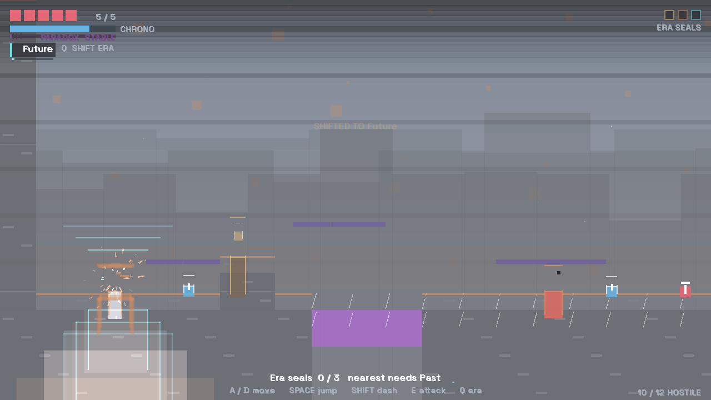
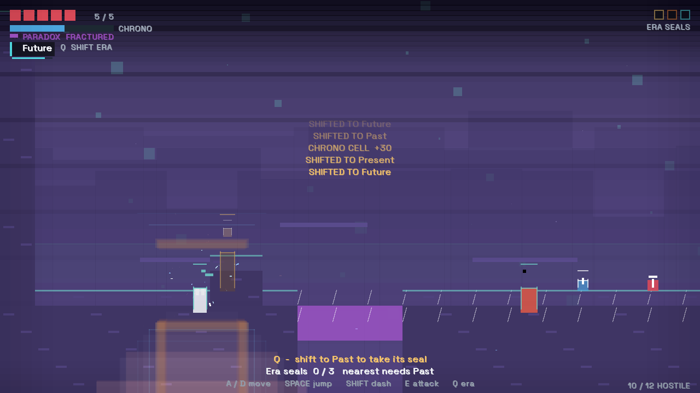
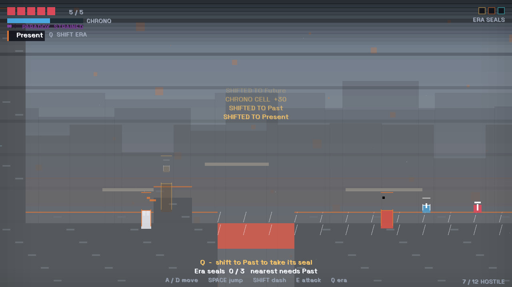
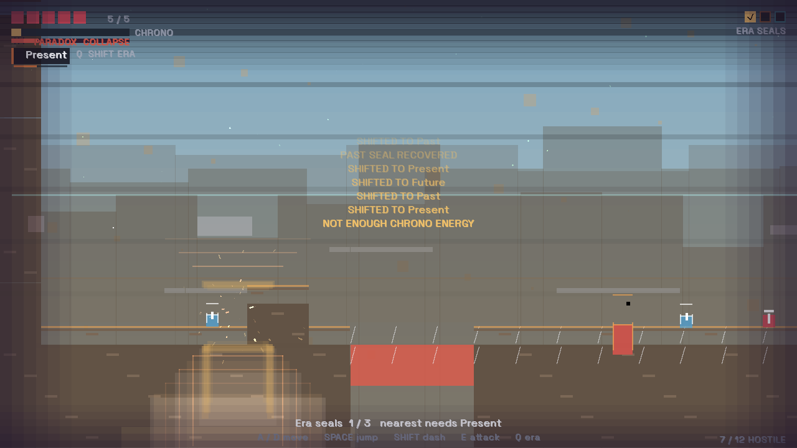
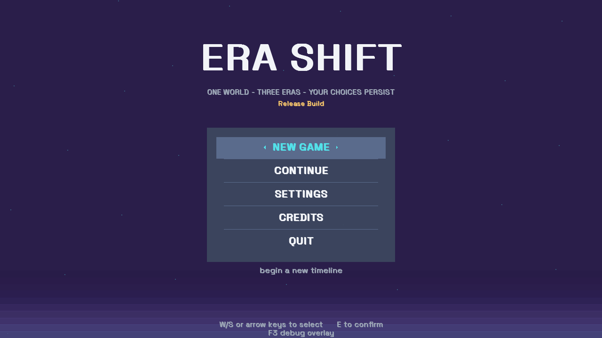
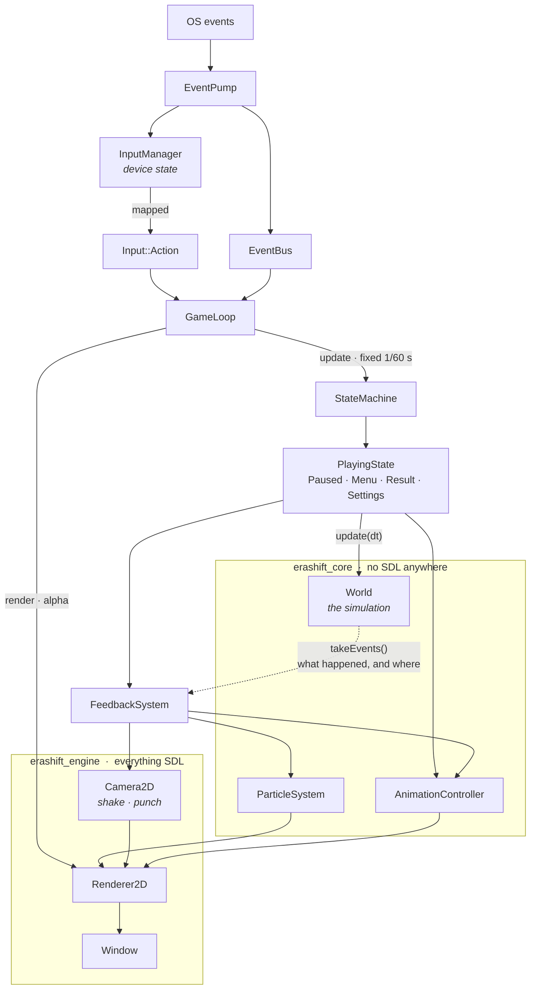
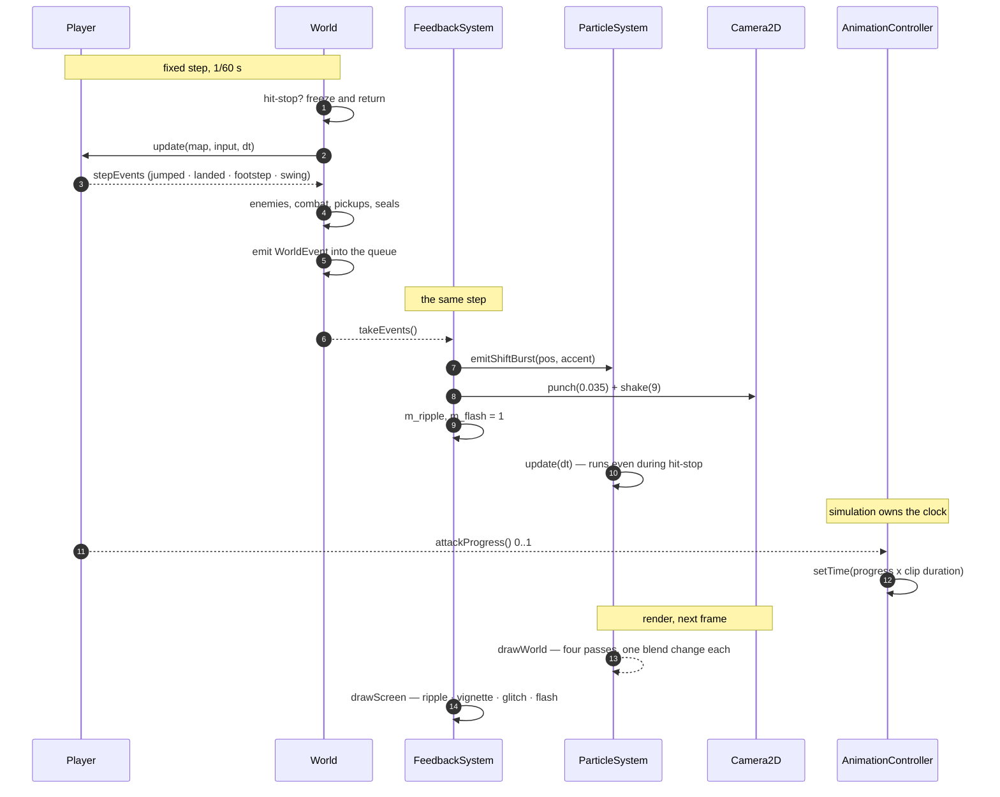

<div align="center">

# Era Shift

**One world. Three states. The state is the mechanic.**

A 2D action-adventure built on a single world that changes across three eras —
the Past, the Present and the Future — where changing time is both your movement
ability and your only defence.



*An era shift caught mid-flight — expanding shockwave rings, debris sparks, a
screen flash and a camera punch, all triggered by one simulation event.*

</div>

> *The world is one world, but time changes its state.*

**Status: Phase 3 — playable vertical slice, with procedural animation and
effects.** The Ancient Forest runs from spawn to the Ancient Gate: era-dependent
terrain, enemies that only exist in some eras, melee combat, three era seals,
hazards, pickups, saves, and the full menu set. Every character is a procedurally
animated rig, and every impact has particles, light and hit-stop behind it.

There is not a single sprite asset in the repository, and
[`assets/README.md`](assets/README.md) explains why that is a decision rather
than an omission.

---

## Contents

- [Quick start](#quick-start) · [Controls](#controls) · [How to play](#how-to-play)
- [Screenshots](#screenshots) · [Architecture](#architecture) — the two diagrams
- [What is in the box](#what-is-in-the-box) — animation, effects
- [Project layout](#project-layout) · [Documentation](#documentation)
- [Build configurations](#build-configurations) · [Testing](#testing)
- [Development rules](#development-rules) · [Dependencies](#dependencies)

---

## Quick start

```bash
# 1. Dependencies (only needed if your distro has no SDL3 packages)
./scripts/fetch_deps.sh

# 2. Build
cmake --preset debug
cmake --build --preset debug

# 3. Run
./build/debug/EraShift

# 4. Tests — headless, no display
ctest --preset debug --output-on-failure
```

### Command line

| Option | Purpose |
| --- | --- |
| `--frames <n>` | Quit after n frames. `0` means no limit. |
| `--headless` | Dummy video driver, for CI, SSH and containers. |
| `--screenshot <png>` | Write a PNG of the window. |
| `--screenshot-frame <n>` | Which frame to capture (default 30). |
| `--start-state <s>` | Open on `playing`, `settings`, `credits` or `paused`. |
| `--level <file>` | Load a specific level instead of the shipped one. |
| `--demo` | Replace input with the built-in attract script. |
| `--content <dir>` | Load assets and data from elsewhere. |
| `--set key=value` | Override any configuration value. |
| `--log-level`, `--log-file` | Logging. |

`--start-state`, `--level` and `--demo` exist so every screen can be captured and
smoke-tested without playing through to it. That is also how the screenshots in
this repository were produced.

```bash
# Headless smoke test, as used in CI
./build/debug/EraShift --headless --frames 120

# Capture a frame mid-run
./build/debug/EraShift --demo --frames 200 --start-state playing \
    --screenshot /tmp/shot.png --screenshot-frame 200

# Force a fully paradoxed run without playing it
./build/debug/EraShift --demo --frames 400
```

---

## Controls

| Key | Action |
| --- | --- |
| `A` `D` / arrows | Move |
| `Space` | Jump — hold for height, tap for a short hop |
| `Left Shift` | Dash, with brief invulnerability |
| `Left Mouse` | Attack |
| `E` | Interact, take a seal, confirm |
| `Q` | **Era Shift** — the signature mechanic |
| `Esc` | Pause |
| `F3` | Debug overlay |
| `F12` | Screenshot |

Everything is rebindable in Settings → Controls, and the bindings persist.

---

## How to play

The Ancient Gate stays shut until all three era seals are recovered, and each seal
only yields while the world is in *its* era. The terrain is written the same way:
one chasm is bridged by crumbling stone that only exists in the Past, the next by
a structure that still stands in the Present, the last by crystal that has not
grown yet in the Future. The level is therefore a sequence of era switches rather
than a corridor — walk until the ground runs out, then change time.

**Shifting costs chrono energy**, which regenerates slowly and is refilled by the
blue cells. Wardens only exist in the Past and wisps only in the Future, and
neither can be hit while it is not in the world. So:

- **Shifting out** is a way to escape an enemy you cannot fight.
- **Shifting in** is the only way to fight it.

Each shift and each kill adds **paradox**, and paradox is the run's own pressure.
It does not stop you playing; it changes how the game *feels* — the screen starts
to tear, the edges of the world close in. See [Paradox](#paradox).

---

## Screenshots

Every image here is a real frame from the build, captured with the game's own
`--screenshot` flag. Nothing is mocked up.

### The three eras, one world

The same view of the Ancient Forest in two of its three time states. The terrain
is the same grid — what is solid, what is a hazard and what glows is all era
data, so the level is a sequence of era switches rather than a corridor.

| Future | Present |
| --- | --- |
|  |  |
| **Future.** Whole-tone palette, embers rising from below, crystal that has not grown yet. The only era where the ground is *added* rather than taken away. | **Present.** Natural-minor palette, near-weightless dust. The era that is supposed to look like ours, and the only one whose scale actually resolves. |

### Paradox at Collapse



Paradox is the run's accumulation of shifting and killing, and it is the only
number in the game that changes how it *feels* rather than how it plays. At the
top tier the gauge reads `COLLAPSE`, the picture tears in horizontal bands, and
the edges of the world close in. The centre of the
screen stays clear on purpose — a game you cannot see is not tense, it is broken.
The objective line stays legible for the same reason.

### The title screen



<details>
<summary>How to regenerate these</summary>

Every image above is a real frame, produced by the same flag documented above.
Nothing is drawn by hand, so they cannot drift out of date the way a mock-up
would.

```bash
# A gameplay frame
./build/release/EraShift --headless --demo --frames 340 \
    --start-state Playing \
    --screenshot docs/screenshots/era-future.png --screenshot-frame 80

# The title screen
./build/release/EraShift --headless --frames 120 \
    --screenshot docs/screenshots/title.png --screenshot-frame 45
```

`--demo` replaces input with the built-in attract script, which is why the run is
reproducible: the same frame number gives the same picture.

</details>

---

## Architecture

Two diagrams, because one is not enough to say anything useful. The first is the
frame: who calls whom, and when. The second is the data flow *within* a frame for
the gameplay path, which is where the interesting constraint lives.

### The frame



The box at the bottom left is the whole point of the split. `World`,
`ParticleSystem` and `AnimationController` are **pure arithmetic with no SDL
anywhere**, which is why the entire simulation — and the animation controller and
the particle pool — can be unit tested on a headless machine with no display.

### A gameplay step



Two things in that diagram are worth reading twice.

**`FeedbackSystem` runs even when the world is frozen.** On a heavy hit the
simulation stops for 45–200ms, and the spark that caused the freeze keeps
travelling. That is what hit-stop *is*: a still world and a live effect.

**The animation has no clock of its own.** It is told where the simulation is,
via `attackProgress()`. Two independent timers over the same 0.32 seconds would
work right up until a frame hitched, and then the swing would have visibly
recovered while the hitbox was still open.

The reasoning behind every layer is in
[`docs/ARCHITECTURE.md`](docs/ARCHITECTURE.md); the feedback systems in
[`docs/FEEDBACK.md`](docs/FEEDBACK.md).

---

## What is in the box

### Animation — poses, clips, and markers

A character is four rectangles. A rectangle animated well needs nine numbers.

- **`Game::Pose`** is those nine: squash, stretch, bob, lean, limb swing, limb
  spread, arm extension, alpha.
- **21 clips** — idle, walk, run, jump, fall, land, dash, attack, hurt, death,
  shift-charge, and eight enemy states.
- **Clips carry markers**, and a marker can be a gameplay event. The attack's
  hit window is at 0.06s because `PlayerTuning` says the windup ends there, and a
  test asserts the two still agree.
- **Which clip plays is a function of the simulation, in `Game/Animation.cpp`**,
  next to the clip table rather than in the state that draws the player — so the
  headless gameplay suite can assert on the decision. Being struck and dying are
  forced past the rule below, because a reaction the player cannot see is a
  reaction that did not happen.
- **Non-looping clips refuse to be cut short**, so mashing attack does not
  visually restart the swing while the input buffer queues a second one.
- **The charge pose is translucent, and only appears while the shift key is
  actually down** — the same condition that drives the charge aura, so the
  character and the particles cannot disagree about whether the player is
  charging.
- **Footsteps are counted in ground covered, not in time.** A clock-tied footstep
  slides at low speed and scrabbles at high speed.

### Effects — particles, light, camera

- **A fixed pool of 768 particles, no allocation during play.** When it is full
  the oldest is recycled, so a new shift beats an old footstep.
- **Era weather that is actually different.** Leaves fall from above in the Past,
  dust drifts in the Present, embers rise from below in the Future — opposite
  halves of the screen, which is what the eye reads as a different place.
- **The shift**, in one call: particles pulled inward while charging, then a
  three-ring shockwave and 34 sparks outward.
- **Camera punch** as well as shake, decaying back to the zoom the player set
  rather than pushing it permanently.
- **Screen effects**: a ripple on a shift, a paradox vignette, glitch bars that
  regenerate every 160ms rather than every frame, and a flash.
- **Hit-stop** in the simulation, not the renderer, so the enemy stops too.

### Paradox

Paradox is the run's accumulation of shifting and killing. It is the only number
in the game that changes how it *feels* rather than how it plays, so it has named
tiers rather than a slider — a player can be told "you are at Tier 3" and
understand that, whereas "your paradox is 41.2" means nothing.

| Tier | Paradox | What changes |
| --- | --- | --- |
| `Calm` | 0 | — |
| `Strained` | 18 | slight vignette, denser weather |
| `Fractured` | 38 | glitch bars, heavier vignette |
| `Collapse` | 62 | the bar turns red, the tearing is constant, the edges close in |

One eased value, `FeedbackSystem::tension()`, drives the vignette, the glitch bars
and the weather density, so everything destabilises together rather than in
sequence.

---

## Project layout

```
include/EraShift/       Public headers, mirroring src/
  Core/                 Logging, config, timing, game loop, state machine  (no SDL)
  Application/          Engine, event bus, state context
  Graphics/             Window, renderer, textures, text, maths, colour,
                        ParticleSystem
  Input/                Keyboard, mouse, action bindings
  Debug/                Performance counters, overlay
  Game/                 World, player, enemies, level, Animation, Feedback,
                        EraTheme
  Game/states/          Title, playing, paused, results, settings, credits
src/EraShift/           Implementations
tests/
  unit/                 No SDL, no display
  integration/          No display, several systems together
  gameplay/             The whole simulation, plus the animation and particle
                        systems. Still no SDL, still no display
assets/                 One font. See assets/README.md for why that is all
data/levels/            Data-driven content (JSON)
config/                 Layered JSON configuration
scripts/                Dependency bootstrap, crash harness, font generator
docs/                   Architecture and design documents
  screenshots/          Real captured frames, referenced by this file
```

`erashift_core` contains **no SDL dependency at all**. That is not tidiness — it
is the reason the whole test suite, including the animation controller and the
particle system, runs on a headless machine.

---

## Build configurations

| Preset | Path | Sanitizers | Tests |
| --- | --- | --- | --- |
| `debug` | `build/debug` | – | yes |
| `release` | `build/release` | – | no, `-Werror` |
| `relwithdebinfo` | `build/relwithdebinfo` | – | yes |
| `asan` | `build/asan` | Address + UB | yes |
| `ubsan` | `build/ubsan` | Undefined behaviour | yes |
| `tsan` | `build/tsan` | Thread | yes |

```bash
cmake --preset asan && cmake --build --preset asan
ASAN_OPTIONS=detect_leaks=1 ./build/asan/EraShift --headless --frames 300
ctest --preset asan
```

---

## Testing

```bash
ctest --preset debug --output-on-failure
./build/debug/erashift_tests_gameplay --success   # verbose
./scripts/reproduce_crash.sh                       # crash regression harness
```

The four binaries, and what each is for:

| Binary | Cases | Covers |
| --- | --- | --- |
| `erashift_tests_unit` | 94 | Maths, logging, config, timing, the game loop, the state machine, the font |
| `erashift_tests_integration` | 10 | The documented state flow, config round trips and migrations |
| `erashift_tests_gameplay` | 154 | The whole simulation, plus the animation controller and the particle pool |
| `erashift_tests_platform` | 10 | The SDL boundary: the event pump |

`gameplay` links **only** `erashift_core` and no SDL whatsoever. That is the rule
that proves the whole simulation is testable on a machine with no display, and it
is why the platform tests are a separate binary rather than folded into it.

Four binaries, all headless: `unit` (no SDL), `integration` (no display),
`gameplay` (the whole simulation) and `platform` (the SDL boundary). The feedback
systems are tested alongside the gameplay, because they are pure arithmetic — 41
cases covering the animation controller and the particle pool, with assertions on
clip timings and emission rates rather than on pictures.

`platform` covers what cannot be: the event pump, which turns SDL events into the
game's own.

See [`docs/TESTING.md`](docs/TESTING.md).

---

## Documentation

| Document | Contents |
| --- | --- |
| [docs/BUILD.md](docs/BUILD.md) | Dependencies, presets, troubleshooting |
| [docs/CONTROLS.md](docs/CONTROLS.md) | Controls and rebinding |
| [docs/ARCHITECTURE.md](docs/ARCHITECTURE.md) | Layering, ownership, the game loop |
| [docs/FEEDBACK.md](docs/FEEDBACK.md) | **Animation, effects, hit-stop, paradox** |
| [docs/TESTING.md](docs/TESTING.md) | Test strategy, sanitizers |
| [docs/PERFORMANCE.md](docs/PERFORMANCE.md) | Profiling, budgets |
| [docs/TECHNICAL_DESIGN.md](docs/TECHNICAL_DESIGN.md) | Engine subsystem designs |
| [docs/GAME_DESIGN.md](docs/GAME_DESIGN.md) | The loop, the resources, the enemies, the combat |
| [docs/ERA_SYSTEM.md](docs/ERA_SYSTEM.md) | How one world is three worlds |
| [docs/CRASH_ANALYSIS.md](docs/CRASH_ANALYSIS.md) | Post-mortem of the Phase 1 SIGSEGV |
| [CHANGELOG.md](CHANGELOG.md) | What changed and when |

`GAME_DESIGN.md`, `ERA_SYSTEM.md` and `FEEDBACK.md` describe the game as it is
implemented, so they stay true rather than aspirational. `TIMELINE_SYSTEM.md` is
deferred: the era cycle is complete, but the persistence rules a full timeline
system needs are not designed yet, and a document describing them would be
fiction.

---

## Development rules

1. Build after every meaningful change; the tree must stay warning-free.
   `release` builds with `-Werror`.
2. Run `ctest` before committing. All presets, including the sanitizers.
3. Add tests alongside the system they cover. The animation controller and the
   particle system are both testable headlessly, so there is no excuse.
4. The simulation decides *what* happens. Presentation decides what it looks like.
   A rule that depends on an effect having finished is not a rule.
5. Update `CHANGELOG.md` and the affected doc in the same commit.
6. Never remove existing functionality without a note in the changelog.

---

## Dependencies

| Library | Version | Purpose |
| --- | --- | --- |
| SDL3 | 3.4.16 | Windowing, input, rendering, events |
| SDL3_image | 3.4.6 | Image loading |
| SDL3_ttf | 3.2.2 | Font rasterisation |
| nlohmann/json | 3.11.3 | Configuration and save data |
| doctest | 2.4.12 | Unit testing |

`scripts/fetch_deps.sh` builds all of them into `.deps/install` **without
needing root**. Distribution packages are used automatically when present.

Fonts: `assets/fonts/SpaceGrotesk.ttf` (SIL Open Font License, see
`assets/fonts/SpaceGrotesk-OFL.txt`).

---

## License

See [LICENSE](LICENSE).
